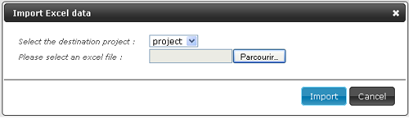

# How to import requirements ?

The Import function allows you to upload requirements into a selected project. The imported file must be in .xls or .xlsx format. Different rules must be respected and are detailed below.

## Importing an excel file

!!! note "Prerequisite"
    A project of the tree structure in Requirement workspace is selected. Being in the Requirement workspace.

1. Click on the button [Import/Export]. A drop down menu opens up:
    
2. Click on the link [Import] in the drop down menu. A pop-up « Import in excel format » opens :
    - Select the project in which the import is uploaded.
    - Click on the button [Choose File] to choose the file to import
        
3. Click on the [Import] button. A confirmation pop-up opens.
4. Click on [Ok]. When the file upload ends, a pop-up opens up detailing :
    - Total number of requirement in the excel file,
    - Total number of successfully uploaded requirement,
    - Number of non uploaded requirement.
5. Click on [Ok] and refresh the page. Imported requirements are displayed in the selected project tree structure

!!! FOCUS "Focus"
    It is possible to import the links between requirements and test cases.
    Click on the button [Import], select [Import links] and then follow these steps.

## Model of import file

The import file must be in .xls or .xlsx format to be readable by Squash.
It does also respect different rules listed below :

- Only the first tab will be uploaded, the other tabs will be ignored
- Uploaded data are materialized by a tag/value couple
- The tags are always placed in first line (top-head of the table), no matter the order
- Values are placed in lines below the first tag's line
- The upload is made by line, no matter the order of lines
- Field's names or the first column are not case sensitive
- Empty lines are not interpreted
- Cells do not be merged
- The excel file has a table which contains the following described columns:

| TAG         | Definition |
|:------------|:-----------|
| PATH        | Path to follow to find the requirement in the tree structure. |
| ID          | Automatically filled in by the system |
| VERSION     | Creating the requirement, the version number is always 1. |
| LABEL       | Obligatory |
| REFERENCE   | Optional |
| DESCRIPTION | Optional |
| CRITICALITY | Optional value to choose in the following list (by default « undefined »): 1- Critical ; 2-  Major ; 3- Minor ; 4- Undefined |
| CATEGORY   | Optional value to choose in the following list (by default « undefined »): Functional ; Non functional ; Business ; Use case ; Test requirement ; Undefined  |
| STATE      | Optional ( by default « work in progress »)  Value to choose in the following list :  Obsolete ; Approved ; Under review ; Work in progress |
| CREATED_ON | Requirement creation date |
| CREATED_BY | Login of the requirement creator user |
