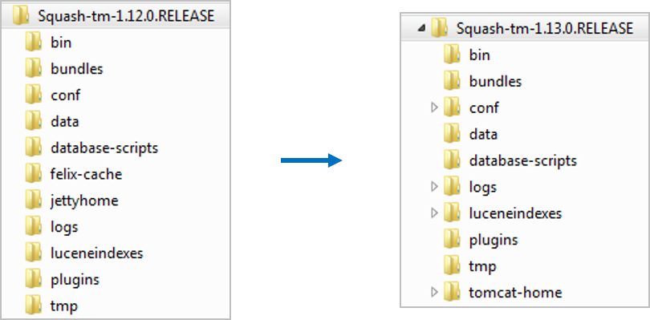

# Squash TM 1.13+ installation

From Squash TM 1.13 and onwards, the embedded web server with Squash TM is Tomcat (in lieu of Jetty). 

- The Squash directory has been modified as follows :

- Squash plug-ins are now to be installed in the `plugins` folder, formerly `bundles` (see 2.07 - Install and configure a Squash TM plug-in)
- Squash configuration are now available in the `squashtm.cfg.properties` file (previously several files in the `conf/services` folder)
- The Squash upgrade procedure has been modified (see 2.06 - Upgrade Squash TM)
- Squash can now be deployed in an existing Tomcat 8 server (see 2.08-Deploy Squash TM in Tomcat)